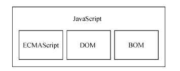

## JavaScript 介绍

> 该页节选自 《JavaScript 高级程序设计》第四版

***序***

工业革命是钢铁铸就的，互联网革命则是 JavaScript 造就的。25 年的反复锻造与打磨，成就了 JavaScript 在今天的应用程序开发中毋庸置疑的统治地位，但并非一开始就是如此。 

Brendan Eich 只用 10 天就写出了 JavaScript 的第一版。初生的 JavaScript 看似弱不禁风，但历史表明，第一印象并不代表一切。

它是目前唯一一个可以随处部署的语言：服务器、桌面浏览器、手机浏览器，甚至原生移动应用程序中都有它的身影。

***作者***

Brendan Eich - 布兰登 艾奇

***什么是JavaScript***

1995 年，JavaScript 问世。当时，它的主要用途是代替 Perl 等服务器端语言处理输入验证。

在此之 前，要验证某个必填字段是否已填写，或者某个输入的值是否有效，需要与服务器的一次往返通信。

网 景公司希望通过在其 Navigator 浏览器中加入 JavaScript 来改变这个局面。在那个普遍通过电话拨号上网 的年代，由客户端处理某些基本的验证是让人兴奋的新功能。

缓慢的网速让页面每次刷新都考验着人们 的耐心。 从那时起，JavaScript 逐渐成为市面上所有主流浏览器的标配。

如今，JavaScript 的应用也不再局限 于数据验证，而是渗透到浏览器窗口及其内容的方方面面。

JavaScript 已被公认为主流的编程语言，能 够实现复杂的计算与交互，包括闭包、匿名（lambda）函数，甚至元编程等特性。

不仅是桌面浏览器， 手机浏览器和屏幕阅读器也支持 JavaScript，其重要性可见一斑。就连拥有自家客户端脚本语言 VBScript 的微软公司，也在其 Internet Explorer（以下简称 IE）浏览器最初的版本中包含了自己的 JavaScript 实现。 

从简单的输入验证脚本到强大的编程语言，JavaScript 的崛起没有任何人预测到。它很简单，学会 用只要几分钟；它又很复杂，掌握它要很多年。要真正学好用好 JavaScript，理解其本质、历史及局限 性是非常重要的。

***简单的历史回顾***

随着 Web 日益流行，对客户端脚本语言的需求也越来越强烈。当时，大多数用户使用 28.8kbit/s 的 调制解调器上网，但网页变得越来越大、越来越复杂。为验证简单的表单而需要大量与服务器的往返通 信成为用户的痛点。

想象一下，你填写完表单，单击“提交”按钮，等 30 秒处理，然后看到一条消息， 告诉你有一个必填字段没填。网景在当时是引领技术革新的公司，它将开发一个客户端脚本语言来处理 这种简单的数据验证提上了日程。

1995 年，网景公司一位名叫 Brendan Eich 的工程师，开始为即将发布的 Netscape Navigator 2 开发一 个叫 Mocha（后来改名为 LiveScript）的脚本语言。当时的计划是在客户端和服务器端都使用它，它在 服务器端叫 LiveWire。 

为了赶上发布时间，网景与 Sun 公司结为开发联盟，共同完成 LiveScript 的开发。就在 Netscape  Navigator 2 正式发布前，网景把 LiveScript 改名为 JavaScript，以便搭上媒体当时热烈炒作 Java 的顺风车。

由于 JavaScript 1.0 很成功，网景又在 Netscape Navigator 3 中发布了 1.1 版本。尚未成熟的 Web 的受 欢迎程度达到了历史新高，而网景则稳居市场领导者的位置。

这时候，微软决定向 IE 投入更多资源。 就在 Netscape Navigator 3 发布后不久，微软发布了 IE3，其中包含自己名为 JScript（叫这个名字是为了 避免与网景发生许可纠纷）的 JavaScript 实现。

1996 年 8 月，微软重磅进入 Web 浏览器领域，这是网景 永远的痛，但它代表 JavaScript 作为一门语言向前迈进了一大步。 微软的 JavaScript 实现意味着出现了两个版本的 JavaScript：Netscape Navigator 中的 JavaScript，以 及 IE 中的 JScript。

与 C 语言以及很多其他编程语言不同，JavaScript 还没有规范其语法或特性的标准， 两个版本并存让这个问题更加突出了。随着业界担忧日甚，JavaScript 终于踏上了标准化的征程。 

1997 年，JavaScript 1.1 作为提案被提交给欧洲计算机制造商协会（Ecma）。第 39 技术委员会（TC39） 承担了“标准化一门通用、跨平台、厂商中立的脚本语言的语法和语义”的任务（参见 TC39-ECMAScript）。 

TC39 委员会由来自网景、Sun、微软、Borland、Nombas 和其他对这门脚本语言有兴趣的公司的工程师 组成。他们花了数月时间打造出 ECMA-262，也就是 ECMAScript（发音为“ek-ma-script”）这个新的脚 本语言标准。 

1998 年，国际标准化组织（ISO）和国际电工委员会（IEC）也将 ECMAScript 采纳为标准（ISO/  IEC-16262）。自此以后，各家浏览器均以 ECMAScript 作为自己 JavaScript 实现的依据，虽然具体实现 各有不同

***JavaScript的实现***

JavaScript 实现 虽然 JavaScript和 ECMAScript 基本上是同义词，但 JavaScript远远不限于 ECMA-262 所定义的那样。 

没错，完整的 JavaScript 实现包含以下几个部分： 

- 核心（ECMAScript） 

- 文档对象模型（DOM） 

- 浏览器对象模型（BOM） 

ECMAScript，即 ECMA-262 定义的语言，并不局限于 Web 浏览器。

事实上，这门语言没有输入和 输出之类的方法。ECMA-262 将这门语言作为一个基准来定义，以便在它之上再构建更稳健的脚本语言。 

Web 浏览器只是 ECMAScript 实现可能存在的一种宿主环境（host environment）。宿主环境提供 ECMAScript 的基准实现和与环境自身交互必需的扩展。

扩展（比如 DOM）使用 ECMAScript 核心类型 和语法，提供特定于环境的额外功能。其他宿主环境还有服务器端 JavaScript 平台 Node.js 和即将被淘汰 的 Adobe Flash。

如果不涉及浏览器的话，ECMA-262 到底定义了什么？

在基本的层面，它描述这门语言的如下部分：

- 语法 

- 类型 

- 语句 

- 关键字 

- 保留字 

- 操作符 

- 全局对象 

ECMAScript 只是对实现这个规范描述的所有方面的一门语言的称呼。JavaScript 实现了 ECMAScript，而 Adobe ActionScript 同样也实现了 ECMAScript .
