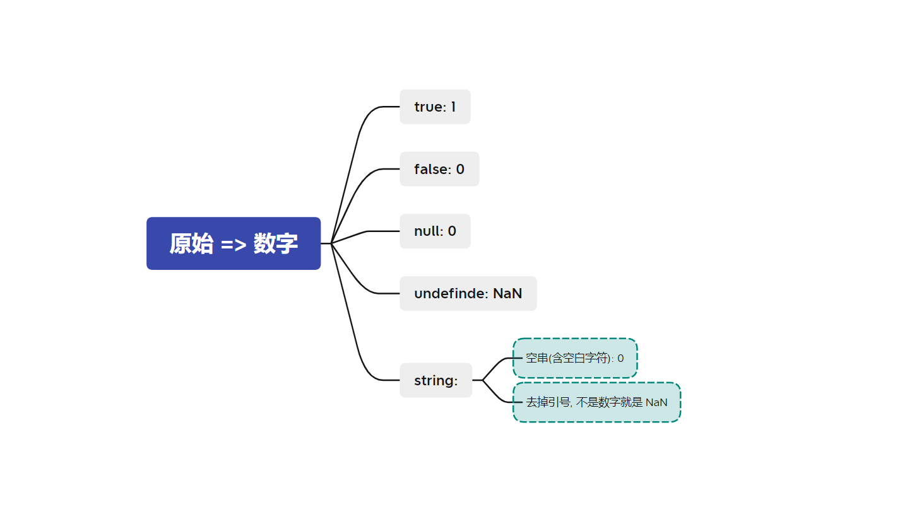
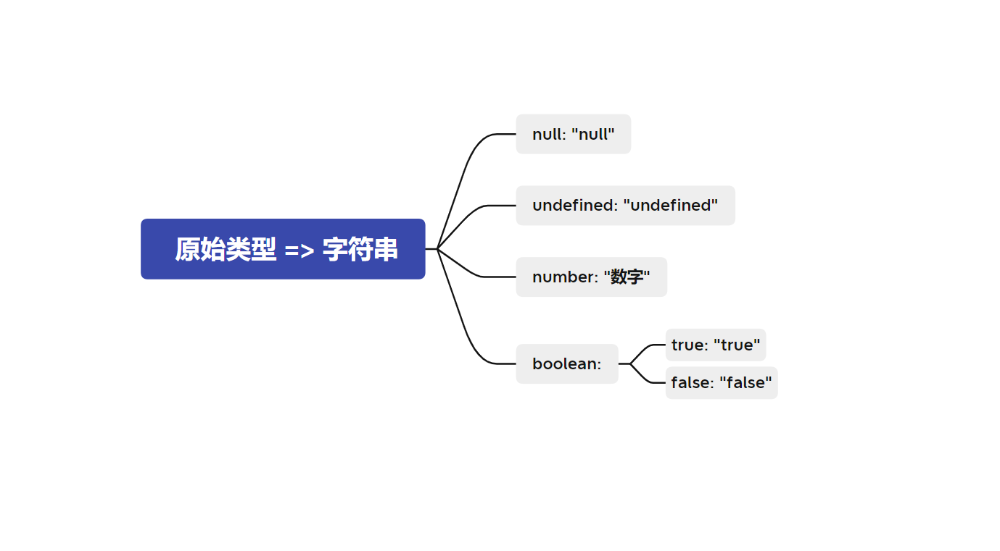
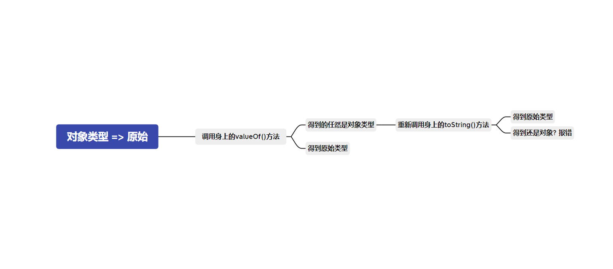
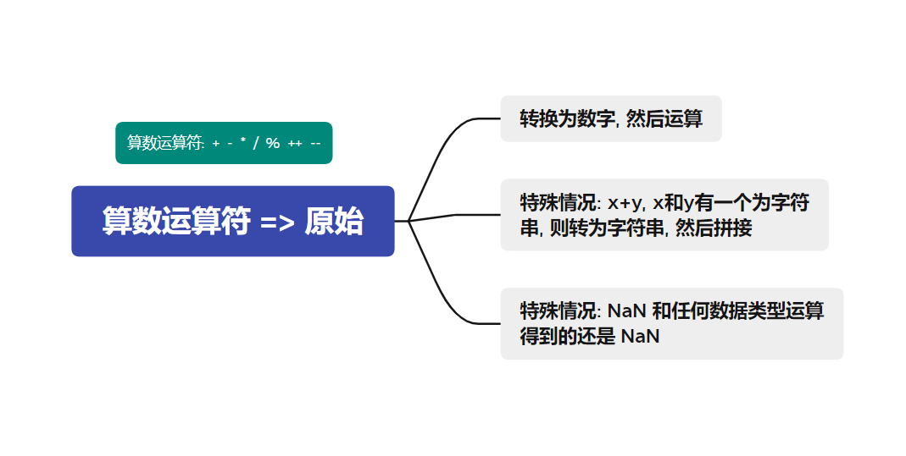
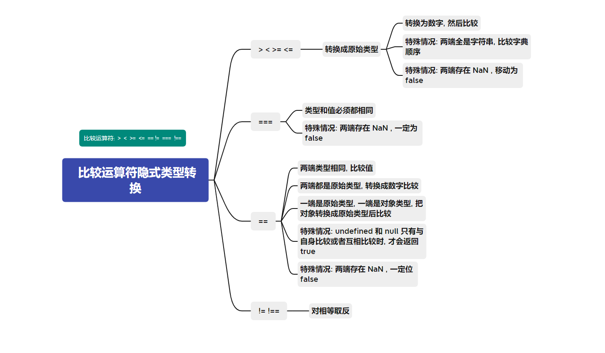
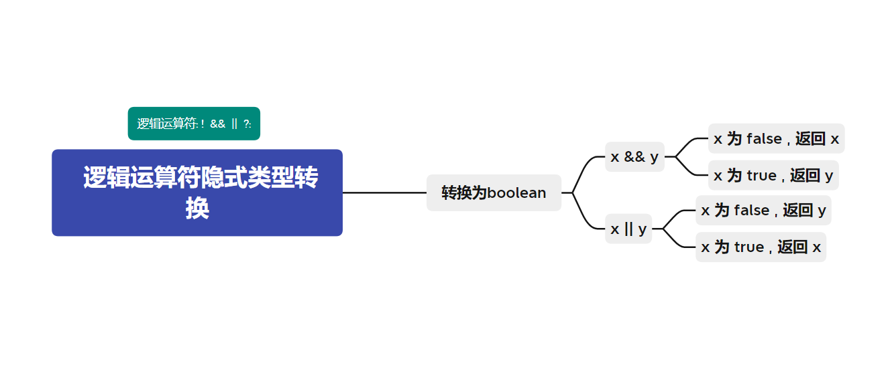

## 隐式类型转换

在js中很多操作符(运算符)存在隐式类型转换

以下是隐式类型转换规则的总结

## 原始类型 => 数字

## 所有类型 => 布尔

## 原始类型 => 字符串

## 对象类型 => 原始

## 算数运算符隐式类型转换

`+` `-` `*` `/` `%` `++` `--` 算数运算符隐式类型转换 => 原始

## 比较运算符隐式类型转换

`>` `<` `>=` `<=` `==` `!=` `===` `!==` 比较运算符隐式类型转换

## 逻辑运算符隐式类型转换

`!` `&&` `||` `?:`

