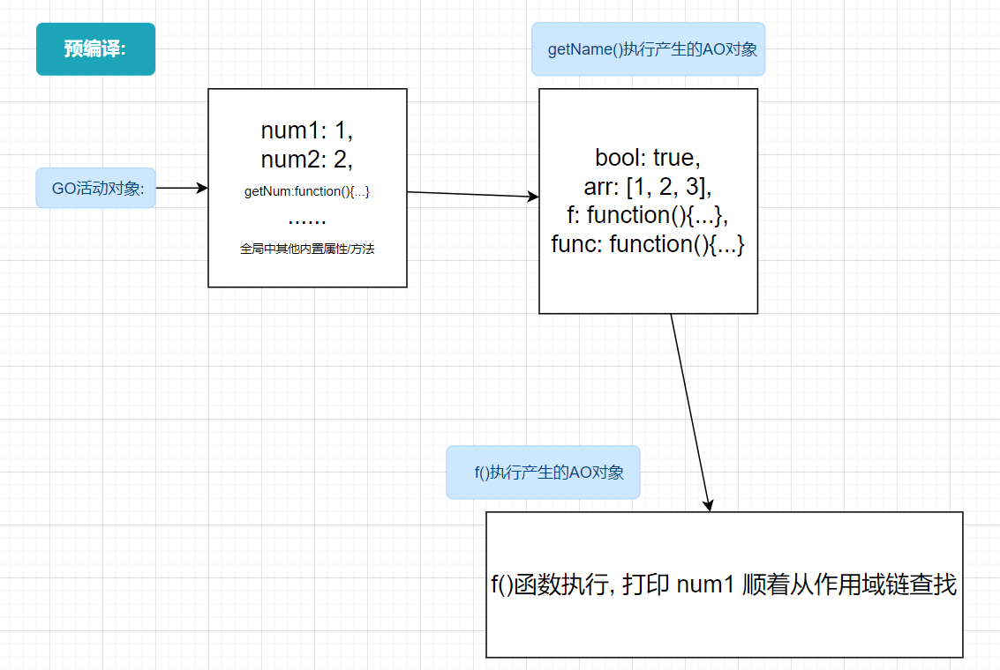

## 作用域链 `*`

> 作用域链 => 一个个作用域串联起来的执行上下文(活动上下文)

作用域链这种东西是比较抽象的, 只能靠领悟吧

作用域链中会涉及到 *函数* *预解析* *作用域* 这些知识 


**示例**

```js
var num1 = 1
var num2 = 2
function getNam() {
    var bool = true
    var arr = [1, 2, 3]
    var func = function() {}
    function f() {
        console.log(num1) // 1
    }
    f()
}
getNam()
```


*解析图:*


