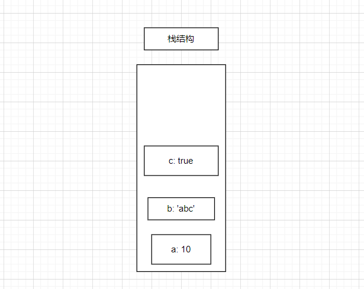
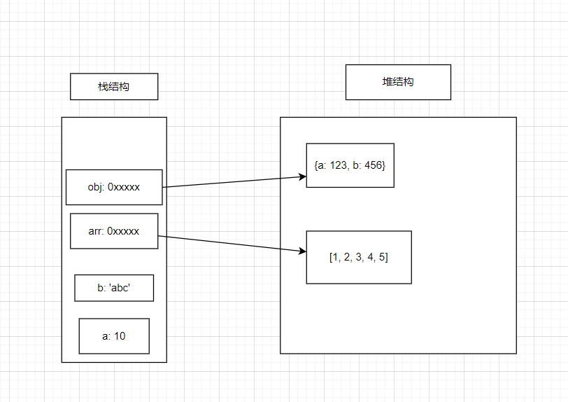

## js中的数据类型

<a href="https://developer.mozilla.org/zh-CN/docs/Web/JavaScript/Data_structures" target="_blank">MDN文档</a> 

截至本文档书写日期 2023-03-13 , js中共存在 ***8*** 种数据类型, ***7*** 个原始类型 + ***1*** 个引用类型


**原始类型:**

- Number 数字
- String 字符串
- Boolean 布尔
- Undefinde 未定义
- Null 空
- Symbol 符号 (es6+)
- BigInt 大整数 (es6+)


**引用类型:**

- Object 对象

引用类型只有一个对象 , 其他引用类型都是特殊的对象

Array , Function , Date 等等都是特殊的对象


## 原始值

原始值具有不可改变性

```js
var num = 123; 
num = 456;
```

内存当中该空间的值是不可改变的，实际内部是舍弃原空间而更改到一个新的空间；

即：将存放 123 的这个空间舍弃而改变到这个新的存放有 456 的空间。


*创建原始值时:*

申请一个栈空间 , 将值放入栈空间中


*内存结构中的栈:*

栈结构类似一个有底无定的盒子 , 先进去的数据永远是最后出来

如下图:

当需要取 a 变量的数据时需要先取出 c 和 b , 然后才能取 a





## 引用值

引用值的数据将会存放在内存中的 堆结构中

在创建引用值时会向内存申请一块栈空间和堆空间 , 将数据存放在 堆 中, 随后将堆数据的引用地址放置在栈中


*内存中的堆结构:*

堆是一种散列结构

如下图:

js中引用值的数据存放在堆中, 引用地址存放在栈中





## 拷贝数据

当拷贝的数据是原始值时将重复制一份新的数据

```js
var num = 10; 
var num1 = num;
// 将 num 空间中的值复制一份出来存放到 num1 中去，num 和 num1 中存放的非同一个；
// 两者已经不是同一个了，num1 是一个全新的, 即：
num = 20;
console.log(num1); // 10 做到你变我不变, 操作的是不同的数据
```


当拷贝的数据是引用值时将复制引用地址

```js
var arr = [1, 2];
var arr1 = arr;
// 仅将 arr 的引用地址复制一份放入 arr1 中，两者指向还是同一空间；
arr1.push(3);
console.log(arr); // [1, 2, 3] 指向同一空间，你变我也跟着改变, 操作的是同一份数据
```


## 本章结语

实际上的内存结构远不止 栈很堆 这么简单, 具体深入了解放在后续


**大致情况:**

- 在js中，内存大致被划分为 **栈** 、**堆** 、**常量区**
- 原始值存放在栈结构中，栈结构类似一个有底没顶的箱子
- 先储存的将会放在底部，取值时先进去的永远在最后出来
- 堆结构则是一个散列的链表结构，引用值就存放在此处
- 在储存原始值时，值会直接放在栈内存中
- 引用值则存放在堆内存中，其引用地址则存放在栈内存