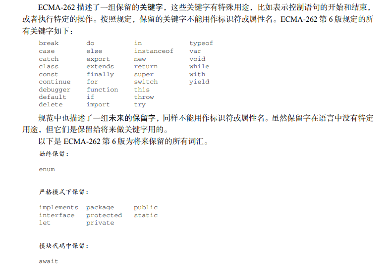

## 命名规范

1. 命名必须以 英文字母 或者 _ 或者 $ 开头
2. 命名可以包括 英文字母 _ $ 数字
3. 命名不可以用系统的关键字、保留字作为变量名

4. 变量命名多个单词组合以小驼峰命名法命名
   - 示例：userName 首个单词的首字母小写后续单词首字母大写

5. 构造函数、类命名使用大驼峰命名
   - 示例：PersonSet 每个组合单词的首字母都大写
6. 常量全部使用大写

## 书写规范

1. 通常以() + - 或正则表达式之类开头的语句, 其上一条语句需要使用分号 ; 进行结束
2. 书写格式规范，= + * / 两边都应该有一个空格
   - 例如: 1 + 1
3. 书写格式规范,  , 后添加一个空格
   - 例如: [1, 2, 3, 4, 5]
4. 一条语句作为一行

## 其他

- js语法错误会引发后续代码终止，但不会影响其他的js代码块

- 各个 script 元素内js出错不会互相影响，还可跨越代码块使用数据

- js中区分大小写

- js单行注释 // 注释内容

- js多行注释 /* 注释内容 */
- js开启严格模式, 在逻辑的最顶端   `"use strict";`

> 常见两种错误：

- 低级错误（语法解析错误）
- 逻辑错误（标准错误）

## 关键字和保留字

